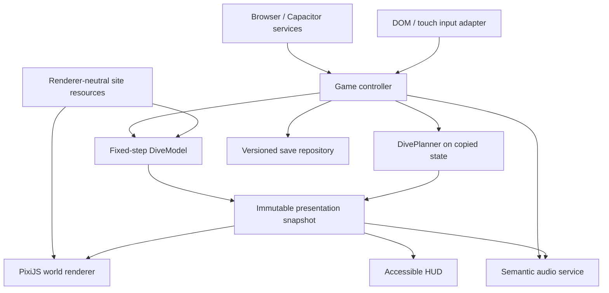

# Implementation decisions

This document records the decisions that govern the 2.5D migration. It is
normative: implementation issues and pull requests must follow it unless a
later committed decision explicitly supersedes a section.

## Delivery model

- Use an incremental strangler migration.
- Keep the current HTML/Canvas client runnable and deployable as the reference
  client until the release work package retires it.
- Keep authoritative simulation changes separate from renderer changes.
- Require an independently reviewed fixture change for every intentional model
  correction. Never update expected values only to make a test pass.
- Treat each work package as an epic made up of dependency-linked issues small
  enough to review independently.

Issue states are:

- `READY`: dependencies and required inputs exist.
- `BLOCKED_EXTERNAL`: a named person, account, device, credential, review, or
  production asset is missing. Only the affected issue stops.
- `BLOCKED_TECHNICAL`: an executable check disproves the current approach.
- `ACCEPTED`: every command and item of required evidence passes.

## Locked product decisions

| Area | Decision |
| --- | --- |
| Product | A fictional 2.5D diving simulation in Games / Simulation. It is not training, certification, medical guidance, a dive computer, or a real-dive planning tool. |
| Release scope | The intended first release territories are the United States and Germany, with English and German as release-blocking locales. EU trader disclosure conflicts with minimal public identity exposure and must be resolved before production identity or store records are created. |
| Platforms | Android 10 / API 29 or newer and iOS 16 or newer. Mobile supports portrait and landscape, touch, safe rotation, and pause/re-layout. Web supports keyboard. Controller support is deferred. |
| Android target API | `targetSdk` is not pinned this early. Record the Google Play requirement and verification date when the native project is created, and re-check it immediately before every submission. |
| Browsers | The latest two major Chrome, Edge, Firefox, and Safari releases. CI exercises Chromium, Firefox, and WebKit. |
| Commerce | None. No advertising, purchase, subscription, entitlement, consent-management SDK, or unlock path exists in the client. |
| Telemetry | No product analytics, advertising identifier, fingerprinting, or third-party crash/performance telemetry SDK. Diagnostic export is explicitly user initiated. |
| Saves | Local, versioned saves only. Accounts, cloud saves, and cross-device synchronization are out of scope. |
| PWA | Installation is deferred. |
| Beta exit | Complete scenario/device evidence, a 14-day private-beta soak, at least 99.5% crash-free sessions where aggregate store diagnostics are available, no reproducible release-blocking lifecycle defect, zero unresolved Critical or High safety findings, and manual product-owner approval. |

The public display name, publisher identity, production application IDs, final
logo, and trademark position are undecided. Internal native builds may use the
temporary identifier `monster.gorman.scuba.divingsimulator.dev` and clearly
development-only branding. Production records and signing must not use them.

## Safety and claims

- Show a concise simulation-only use boundary in the current web client during
  the baseline work package; do not wait for store hardening.
- Maintain a versioned claims register covering numerical, decompression,
  medical, training, prevention, warning, help, screenshot, website, and store
  statements.
- Seed the register from `docs/research/`, but re-anchor the existing algorithm
  audit to current source files before treating it as evidence.
- Require first-run acknowledgement and an always-accessible Safety and
  Methodology screen before public distribution.
- Keep `SIMULATION` visible wherever a screen could be mistaken for a real dive
  computer or exported plan.
- A qualified diving-domain review and territory-specific legal review are
  external public-release gates. Engineering must not represent either as
  complete without the dated acceptance artifacts.

## Architecture

`game-controller.ts` is the composition root. Platform adapters provide
services to the controller; the controller owns simulation, save, planner,
snapshot, audio, and render coordination.

`DiveModel`, `DivePlanner`, site schemas, trace fixtures, and save migrations
must not import PixiJS, DOM APIs, or Capacitor. Input adapters emit intents and
must not mutate model fields directly. Rendering consumes immutable
presentation snapshots.

## Engineering defaults

### Accessibility and localization

- Target WCAG 2.2 AA. Success Criterion 2.5.8 has a 24 by 24 CSS pixel minimum;
  this product additionally adopts 44 by 44 CSS pixels as its internal touch
  target standard.
- Provide visible keyboard focus, DOM/native labels for critical controls and
  status, live warning text, reduced-motion support, and text scaling.
- Do not encode meaning only through color, motion, or sound.
- Establish a string catalogue and locale-aware depth, pressure, duration, and
  gas-fraction formatting with the dual-client toolchain. New TypeScript
  modules must not introduce literal user-facing strings outside the catalogue.
  Translation and review remain part of product hardening.

### Performance evidence

- Use at least 300 warmed samples per named scene and device for each run.
- Record sample count, minimum, median, p95, p99, maximum, long-frame count,
  and total time above 16.67 ms per 1,000 frames.
- Compare three independent runs on the same device and build.
- Accept a Canvas stabilization only when the selected primary metric improves
  by the issue's threshold and no reported metric regresses by more than 5%.
- Preserve an isolated rollback path and prove authoritative traces do not
  change.
- Desktop emulation is diagnostic evidence, not physical-device acceptance.
- WP-01 desktop Canvas evidence is a relative hotspot ranking, not an absolute
  frame-time gate. Before/after measurements must run back to back in the same
  session because unchanged renderer captures have shifted roughly 3x between
  sessions.
- `artifacts/wp-01b/desktop-reference/before.json` (`sourceCommit: bcee12e`,
  generated by `node scripts/compare-performance.mjs`) used the pre-fix
  harness. Recapture it before evaluating WP-01B's "p95 improves >=20%" gate;
  the existing WP-01B artifact cannot establish that gate. Resolved for WP-01B
  under session `wp01b-20260802-guarded-tip`; the same recapture is still owed
  by any other work package whose evidence predates the same-session rule.
- Report a stabilization result as a magnitude, not a precise percentage. The
  gate divides by whatever the session's before value happened to be, and the
  same unoptimized wreck renderer has measured 37-38 ms, 46-50 ms, and 224 ms
  medians across three sessions on one machine. Quote the budget outcome
  (long frames per 300) alongside any percentage.
- Diagnostics probes are an optional observer everywhere, not only in
  `game-loop.js`. Any file that adds a named pass must resolve the collector
  through a guard, and `renderer.js` must resolve it lazily because it is
  parsed before `diagnostics.js`. A regression test for this must assert that
  the frame loop keeps advancing, not merely that `gameState` reached
  `diving`: `updateSurface()` sets that before `drawScene()` ever runs, so a
  client frozen by a render-pass throw otherwise passes.

### Visual comparison

- `scripts/compare-rendering.mjs` records a seeded, fixed-state DPR-1 pixel
  comparison between two source trees. It is deterministic across sessions but
  asserts no threshold, so it is review evidence rather than a CI gate.
- Before the renderer slice compares Canvas against PixiJS automatically, this
  needs an agreed per-scene pixel-delta budget and a failing exit code. Until
  then, no work package may cite it as an automated visual gate.
- Guard-scene drift is expected at this scale and is not a regression signal on
  its own. The WP-01B bounded-overlay change moved reef render medians by up to
  +31% while the absolute delta stayed at or below 0.5 ms, on a code path that
  strictly removed work. Judge guard scenes by absolute milliseconds, not
  percent.

### Security and deployment

- Commit schemas and inert placeholders only. Keep application IDs and signing
  material in protected environments.
- Never print or archive keystores, keys, certificates, provisioning data,
  store credentials, or review secrets.
- Verify the deployed Content Security Policy when introducing Workers,
  generated blob URLs, WebAssembly, or renderer changes. Local development
  success is insufficient.
- Build the web application once, test those exact bytes, record their SHA-256,
  and deploy that artifact. A deployment job must not rewrite or delete files
  after the artifact has passed its release checks.
- Keep application deployment separate from Terraform provider/state changes.
- Web rollback redeploys the previous verified artifact. Mobile rollback halts
  staged rollout; save migrations remain forward compatible.

### CI and evidence

The target pull-request checks are Node 22 install, type-check, lint, dependency
license checks, unit/parity tests, Chromium/Firefox/WebKit browser tests, a
production web build, and an Android debug build once native projects exist.
An unsigned iOS compile is required once the named macOS/Xcode environment is
available; until then it remains `BLOCKED_EXTERNAL`.

Machine-readable evidence belongs under
`artifacts/<work-package>/<issue-id>/`. JSON evidence records the source commit,
build identifier, command, timestamp, environment, and relevant device/browser
metadata. Binary evidence has a JSON index with its SHA-256.

## Legacy test harness

`src/diving-simulator-tests.html` remains the legacy behavioral oracle until
the release work package retires the reference client. Assertions move
incrementally into Vitest and parity fixtures during the core, planner, and save
work packages. The harness may be retired only when every retained behavior has
an owned replacement test or an explicitly reviewed disposition.

## External gates

| Gate | Current state | Blocks |
| --- | --- | --- |
| Final identity and publisher, including trader-disclosure decision | `BLOCKED_EXTERNAL` | Production native configuration, store records, signing, and listings |
| Apple account and supported Mac/Xcode environment | `BLOCKED_EXTERNAL` | iOS signing, TestFlight, and App Store submission |
| Google Play account, signing ownership, and internal-track access | Verify before native release work | Signed Android release and Play submission |
| Recorded physical Android/iPhone matrix | Available; matrix not recorded | Physical-device acceptance from the renderer slice onward |
| Qualified diving-domain claims review | `BLOCKED_EXTERNAL` | Product-hardening acceptance and public release |
| Territory-specific legal review | `BLOCKED_EXTERNAL` | Product-hardening acceptance and public release |
| Production art, audio, and store media with rights provenance | `BLOCKED_EXTERNAL` | Replacement of placeholders and release candidate |
| Human approval of declarations and staged rollout | `BLOCKED_EXTERNAL` | Public release only |

These gates do not block baseline, core, browser, renderer, or eligible Android
work unless an issue claims acceptance that depends on the missing artifact.

## Definition of done for a migrated slice

A mechanic or site is migrated only when:

- the new core owns its state and production code no longer reads or writes the
  corresponding legacy global;
- exact or epsilon numerical and event checkpoints pass;
- save/load and pause/resume preserve the state;
- keyboard and touch intents produce equivalent authoritative actions;
- the PixiJS scene has camera culling, bounded allocations, quality tiers, and
  no whole-screen effect at an unmeasured resolution;
- interactive controls and critical status have accessible, localizable,
  non-canvas representations;
- every warning has visual equivalence, semantic audio priority, and
  mute/interruption behavior, and audio cannot change authoritative state;
- every externally distributed slice shows the use boundary and links to
  current Safety and Methodology information;
- browser tests and applicable physical-device checks pass;
- removal of a legacy path is covered by a test;
- development renderer selection and diagnostics are absent from production;
  and
- no production credential is in source or evidence, and the bundle contains
  no billing, advertising, consent, or analytics dependency.
